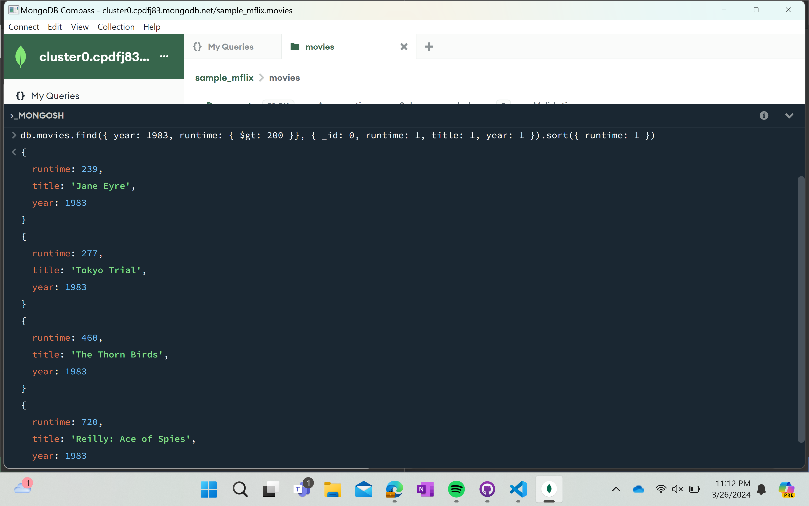
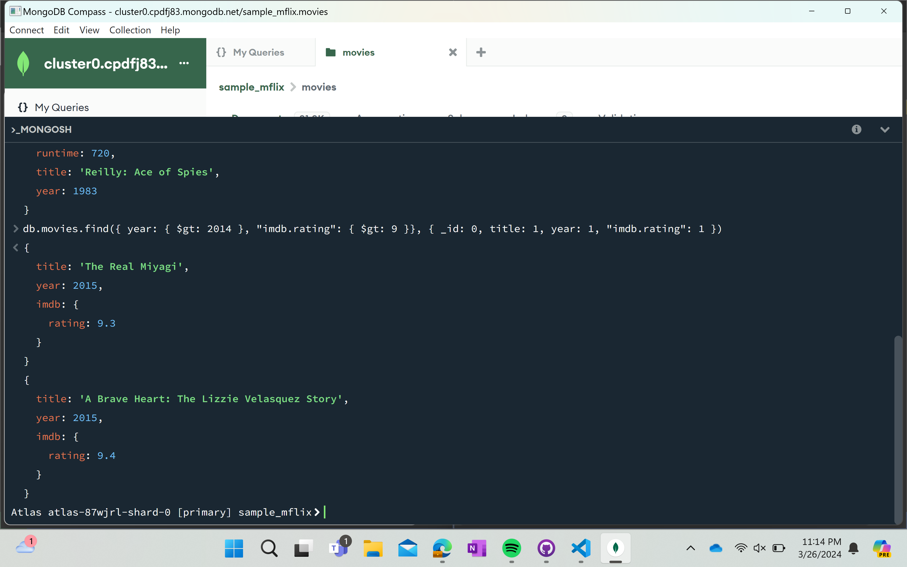

# Assignment-3-MongoDB-Setup-and-Queries

## Query 1

Query: Find all movies with a runtime greater than 200 minutes in the year 1983. Sort the result by runtime in increasing order. Each object should only have three fields: runtime, title, year.

## Query 2

Query: Find all movies released after the year 2014 with an IMDb rating greater than 9. Return the title, year, and IMDb rating for each movie.
